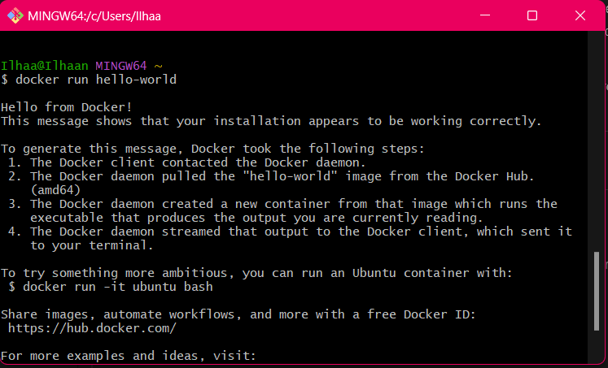
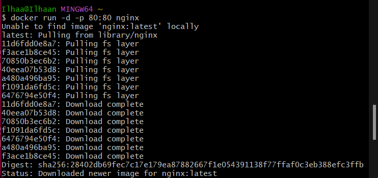
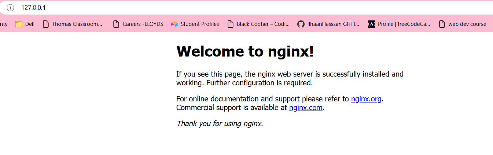
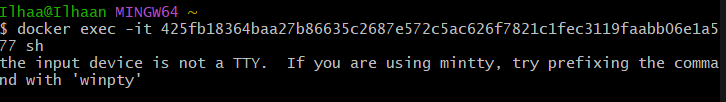

# ***DOCKER***
- [***DOCKER***](#docker)
  - [***Differences between Virtualization and Containerization***](#differences-between-virtualization-and-containerization)
    - [***What is Included in a Container vs Virtual Machine***](#what-is-included-in-a-container-vs-virtual-machine)
    - [***Benefits of Each, Especially Virtual Machine Over Traditional Architecture***](#benefits-of-each-especially-virtual-machine-over-traditional-architecture)
  - [***Microservices***](#microservices)
  - [***Docker***](#docker-1)
  - [***Docker Commands***](#docker-commands)
  - [***Docker Work Flow - Nginx Container***](#docker-work-flow---nginx-container)
    - [***Run commands within a container***](#run-commands-within-a-container)
  - [***Creating my own image***](#creating-my-own-image)

## ***Differences between Virtualization and Containerization***
| Feature               | Virtualization                                       | Containerization                                 |
|-----------------------|------------------------------------------------------|--------------------------------------------------|
| **Isolation**         | Each VM has a full OS and is isolated from others    | Containers share the host OS but have isolated environments |
| **Efficiency**        | Higher resource usage due to multiple OS instances   | More efficient, lightweight; shares OS kernel    |
| **Startup Speed**     | Slower to start, as it boots an OS                   | Starts quickly, as it runs from host OS          |
| **Portability**       | Typically less portable due to OS dependencies       | Highly portable across different environments    |
| **Use Cases**         | Useful for running different OS environments         | Ideal for lightweight applications and microservices |

---

### ***What is Included in a Container vs Virtual Machine***

| Aspect                     | Container                                      | Virtual Machine                      |
|----------------------------|------------------------------------------------|--------------------------------------|
| **OS Kernel**              | Shared with host                               | Separate OS per VM                   |
| **Application Code & Binaries** | Included                                | Included                             |
| **Libraries & Dependencies**   | Included                                   | Included                             |
| **Hypervisor**             | Not required                                   | Required                             |
| **Overhead**               | Minimal                                        | Higher                               |

---

### ***Benefits of Each, Especially Virtual Machine Over Traditional Architecture***

| Benefit                    | Virtual Machine                           | Container                                |
|----------------------------|------------------------------------------|------------------------------------------|
| **Isolation**              | Strong isolation due to separate OS       | Lightweight, less strict isolation       | 
| **Resource Allocation**    | Dedicated resources per VM               | Shares resources more efficiently        |

- **Traditional Architecture**  
  VMs offer better security, hardware emulation, and are suitable for monolithic applications on traditional infrastructure. Containers, by contrast, excel in agility, speed, and are more suited for cloud-native or microservices-based architectures.

---

## ***Microservices***

- **What Are They?**  
  Microservices are a design pattern for building an application as a collection of small, loosely coupled services, each responsible for a specific functionality.

- **How Are They Made Possible?**  
  Enabled by containerization and orchestration tools like Docker and Kubernetes, which allow isolated, independently deployable components.

- **Benefits**  
  - **Scalability:** Each service scales independently.
  - **Flexibility:** Easier to deploy, update, and maintain.
  - **Resilience:** Failure in one service doesn’t bring down the entire system.

---

## ***Docker***

- **What Is It?**  
  Docker is an open-source platform designed to simplify application deployment using containers.

- **Alternatives**  
  - Podman
  - LXC (Linux Containers)
  - rkt (Rocket)
  - OpenVZ

- **How It Works (Docker Architecture/API)**  
  Docker uses a client-server architecture, with the Docker Client communicating with the Docker Daemon to manage containers. The Daemon handles container lifecycle, resource allocation, and API requests.

- **Success Story Using Docker**  
  Companies like Netflix, Spotify, and PayPal use Docker to scale microservices, reduce deployment times, and increase application efficiency.

---

## ***Docker Commands***
- Make sure you run your git bash window as administrator
- **`docker --help`**
- **`docker run hello-world`** produces a randomly named container 

 

- **`docker ps`** shows which processes are running
- **`docker ps --help`**
- **`docker ps -a`**
- **`docker rm <container-name>`**

## ***Docker Work Flow - Nginx Container***
- **`docker run -d -p 80:80 nginx`**: A command that runs a container from the nginx image in detached mode and maps port 80 of the host machine to port 80 in the container. Thisd will be viewable on a webpage for the IP **`127.0.0.1`** or simply input **`localhost`**.

  - **`-d`**: Detached mode. Makes it run in the background.
  - **`-p host_port:container_port`**: Maps port on the host machine to the port in the container. Allows external traffic to the host's port to be routed to the container's port.  

- **`docker stop <container name>`**: Used to stop a container.
- **`docker ps --all (or -a)`**: Shows all containers, including ones that are not currently active.
- `docker
- **`docker start <container name>`**: Start up the chosen container.
- **`docker remove --force (or -f) <container name>`**: Force removes the container, even if active. To do it without forcing, you must first use **`docker stop`**.
- **`alis tf="terraform"`**: Sets up an alias for the **`terraform`** command. Can be used to reduce input.
 
### ***Run commands within a container***
- **`docker exec -it <container ID> sh`**: Used to execute commands within a specified container.
  - **`-it`**: Combines -i (interactive) and -t (allocates a pseudo-TTY) options to allow interaction with the container's terminal.
  - **`sh`**: The shell command that opens a shell session inside the container.
 
*Note! This will give you the following error: **`the input device is not a TTY.  If you are using mintty, try prefixing the command with 'winpty'`**. Fear not! This is normal. To fix this, we can use the **`alias`** command we saw ea:*
 
- **`alias docker="winpty docker"`**: This will replace **`docker`** with **`winpty docker`**, adding that preface we required from the error.

- Running that **`exec`** command will now work, as we've solved he prexifxing issue AND reduced manual input required in the future.
  
- The **`#`** means that we are now inside the container.
 
- **`uname -a`**: We can use this command to see the information regarding the container.
- **`apt-get update -y`**: Updates the local package index to ensure the package lists are current.
- **`-y`**: Flag for "yes" to skip manual inputs.
- **`apt-get upgrade -y`**: Upgrades all installed packages to their latest versions based on the current package index
- **`apt-get install sudo`**: Install sudo onto our container.
---
## ***Creating my own image***
