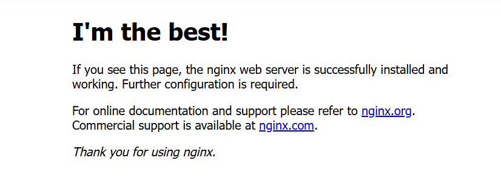
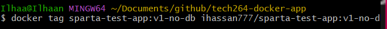
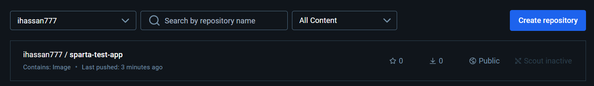

# ***DOCKER***
- [***DOCKER***](#docker)
  - [***Differences between Virtualization and Containerization***](#differences-between-virtualization-and-containerization)
    - [***What is Included in a Container vs Virtual Machine***](#what-is-included-in-a-container-vs-virtual-machine)
    - [***Benefits of Each, Especially Virtual Machine Over Traditional Architecture***](#benefits-of-each-especially-virtual-machine-over-traditional-architecture)
  - [***Microservices***](#microservices)
  - [***Docker***](#docker-1)
  - [***Docker Commands***](#docker-commands)
  - [***Docker Work Flow - Nginx Container***](#docker-work-flow---nginx-container)
    - [***Run commands within a container***](#run-commands-within-a-container)
  - [***Task 1: Create an Image from a Running Container and Push to Docker Hub***](#task-1-create-an-image-from-a-running-container-and-push-to-docker-hub)
    - [***Step 1: Commit the Running Container as a New Image***](#step-1-commit-the-running-container-as-a-new-image)
    - [***Step 2: Push the Image to Docker Hub***](#step-2-push-the-image-to-docker-hub)
    - [***Step 3: Run the Image from Docker Hub***](#step-3-run-the-image-from-docker-hub)
  - [***Automate Creation of a Custom NGINX Docker Image with Modified index.html***](#automate-creation-of-a-custom-nginx-docker-image-with-modified-indexhtml)
    - [***Step 1: Set Up the Folder Structure***](#step-1-set-up-the-folder-structure)
    - [***Step 2: Copy custom index.html to NGINX default location***](#step-2-copy-custom-indexhtml-to-nginx-default-location)
    - [***Step 3: Build the Custom Docker Image***](#step-3-build-the-custom-docker-image)
    - [***Step 4: Push the Custom Image to Docker Hub***](#step-4-push-the-custom-image-to-docker-hub)
    - [***Step 5: Run the Container to Test the Image***](#step-5-run-the-container-to-test-the-image)
  - [***Create an image with the Sparta Test App***](#create-an-image-with-the-sparta-test-app)
    - [***Step 1: Create a new repo with app folder and Dockerfile***](#step-1-create-a-new-repo-with-app-folder-and-dockerfile)
    - [***Step 2: Build your image***](#step-2-build-your-image)
    - [***Step 3: Push to Docker Hub***](#step-3-push-to-docker-hub)
    - [***Step 4: Get your app page up***](#step-4-get-your-app-page-up)
  - [***Use Docker Compose to run app and database containers***](#use-docker-compose-to-run-app-and-database-containers)
    - [***Pre-requisites***](#pre-requisites)
    - [***Step 1: Pull a MongoDB image from Docker Hub***](#step-1-pull-a-mongodb-image-from-docker-hub)
    - [***Step 2: Create a docker-compose.yaml file***](#step-2-create-a-docker-composeyaml-file)
    - [***Step 3: Run your docker-compose.yaml file***](#step-3-run-your-docker-composeyaml-file)
    - [***Step 4: Seed the /posts page manually***](#step-4-seed-the-posts-page-manually)
    - [***Step 5: Check your home and /posts pages***](#step-5-check-your-home-and-posts-pages)

## ***Differences between Virtualization and Containerization***
| Feature               | Virtualization                                       | Containerization                                 |
|-----------------------|------------------------------------------------------|--------------------------------------------------|
| **Isolation**         | Each VM has a full OS and is isolated from others    | Containers share the host OS but have isolated environments |
| **Efficiency**        | Higher resource usage due to multiple OS instances   | More efficient, lightweight; shares OS kernel    |
| **Startup Speed**     | Slower to start, as it boots an OS                   | Starts quickly, as it runs from host OS          |
| **Portability**       | Typically less portable due to OS dependencies       | Highly portable across different environments    |
| **Use Cases**         | Useful for running different OS environments         | Ideal for lightweight applications and microservices |

---

### ***What is Included in a Container vs Virtual Machine***

| Aspect                     | Container                                      | Virtual Machine                      |
|----------------------------|------------------------------------------------|--------------------------------------|
| **OS Kernel**              | Shared with host                               | Separate OS per VM                   |
| **Application Code & Binaries** | Included                                | Included                             |
| **Libraries & Dependencies**   | Included                                   | Included                             |
| **Hypervisor**             | Not required                                   | Required                             |
| **Overhead**               | Minimal                                        | Higher                               |

---

### ***Benefits of Each, Especially Virtual Machine Over Traditional Architecture***

| Benefit                    | Virtual Machine                           | Container                                |
|----------------------------|------------------------------------------|------------------------------------------|
| **Isolation**              | Strong isolation due to separate OS       | Lightweight, less strict isolation       | 
| **Resource Allocation**    | Dedicated resources per VM               | Shares resources more efficiently        |

- **Traditional Architecture**  
  VMs offer better security, hardware emulation, and are suitable for monolithic applications on traditional infrastructure. Containers, by contrast, excel in agility, speed, and are more suited for cloud-native or microservices-based architectures.

---

## ***Microservices***

- **What Are They?**  
  Microservices are a design pattern for building an application as a collection of small, loosely coupled services, each responsible for a specific functionality.

- **How Are They Made Possible?**  
  Enabled by containerization and orchestration tools like Docker and Kubernetes, which allow isolated, independently deployable components.

- **Benefits**  
  - **Scalability:** Each service scales independently.
  - **Flexibility:** Easier to deploy, update, and maintain.
  - **Resilience:** Failure in one service doesn’t bring down the entire system.

---

## ***Docker***

- **What Is It?**  
  - Docker is an open-source platform designed to simplify application deployment using containers.

- **Alternatives**  
  - Podman
  - LXC (Linux Containers)
  - rkt (Rocket)
  - OpenVZ

- **How It Works (Docker Architecture/API)**  
  - Docker uses a client-server architecture, with the Docker Client communicating with the Docker Daemon to manage containers. The Daemon handles container lifecycle, resource allocation, and API requests.

- **Success Story Using Docker**  
  Companies like Netflix, Spotify, and PayPal use Docker to scale microservices, reduce deployment times, and increase application efficiency.

---

## ***Docker Commands***
- Make sure you run your git bash window as administrator
- **`docker --help`**
- **`docker run hello-world`** produces a randomly named container 


<br>


- **`docker ps`** shows which processes are running
- **`docker ps --help`**
- **`docker ps -a`**
- **`docker rm <container-name>`**

## ***Docker Work Flow - Nginx Container***
- **`docker run -d -p 80:80 nginx`**: A command that runs a container from the nginx image in detached mode and maps port 80 of the host machine to port 80 in the container. Thisd will be viewable on a webpage for the IP **`127.0.0.1`** or simply input **`localhost`**.


  - **`-d`**: Detached mode. Makes it run in the background.
  - **`-p host_port:container_port`**: Maps port on the host machine to the port in the container. Allows external traffic to the host's port to be routed to the container's port.  


- **`docker stop <container name>`**: Used to stop a container.
- **`docker ps --all (or -a)`**: Shows all containers, including ones that are not currently active.
- `docker
- **`docker start <container name>`**: Start up the chosen container.
- **`docker remove --force (or -f) <container name>`**: Force removes the container, even if active. To do it without forcing, you must first use **`docker stop`**.
- **`alis tf="terraform"`**: Sets up an alias for the **`terraform`** command. Can be used to reduce input.
 
### ***Run commands within a container***
- **`docker exec -it <container ID> sh`**: Used to execute commands within a specified container.
  - **`-it`**: Combines -i (interactive) and -t (allocates a pseudo-TTY) options to allow interaction with the container's terminal.
  - **`sh`**: The shell command that opens a shell session inside the container.
 
*Note! This will give you the following error: **`the input device is not a TTY.  If you are using mintty, try prefixing the command with 'winpty'`**. Fear not! This is normal. To fix this, we can use the **`alias`** command we saw ea:*
 
- **`alias docker="winpty docker"`**: This will replace **`docker`** with **`winpty docker`**, adding that preface we required from the error.


- Running that **`exec`** command will now work, as we've solved he prexifxing issue AND reduced manual input required in the future.
  
- The **`#`** means that we are now inside the container.
 
- **`uname -a`**: We can use this command to see the information regarding the container.
- **`apt-get update -y`**: Updates the local package index to ensure the package lists are current.
- **`-y`**: Flag for "yes" to skip manual inputs.
- **`apt-get upgrade -y`**: Upgrades all installed packages to their latest versions based on the current package index
- **`apt-get install sudo`**: Install sudo onto our container.
---

## ***Task 1: Create an Image from a Running Container and Push to Docker Hub***
- This is our NGINX page without modification


### ***Step 1: Commit the Running Container as a New Image***

1. **Identify the Running Container**: 
- List running containers to find the one with the modified **`index.html`**.


```bash
   docker ps
```
- Note down the Container ID of your NGINX container.
- Commit the Container to Create an Image:

```bash
docker commit <container-id> ihassan777/custom-nginx-image:latest
```

- Verify the New Image:

```bash
docker images
```
### ***Step 2: Push the Image to Docker Hub***
1. Log in to Docker Hub Online:
2. Push the Image:

```bash
docker push ihassan777/custom-nginx-image:latest
```

### ***Step 3: Run the Image from Docker Hub***
3. Remove the Local Image (Optional):

```bash
docker rm ihassan777/custom-nginx-image:latest
```
4. Run the Container from Docker Hub:

```bash
docker run -d -p 90:80 ihassan777/custom-nginx-image:latest
# -d runs in detached mode.
# -p 90:80 maps port 90 on your machine to port 80 in the container.
```


<br>


5. Test the Container: 
   - Open **http://localhost:90** in a browser to verify your custom **index.html** content.
   



## ***Automate Creation of a Custom NGINX Docker Image with Modified index.html***

### ***Step 1: Set Up the Folder Structure***
1. Create a New Folder named **`tech264-mod-nginx-dockerfile`**


<br>


### ***Step 2: Copy custom index.html to NGINX default location***

<br>

### ***Step 3: Build the Custom Docker Image***
- Build the Image:

```bash
docker build -t ihassan777/tech264-nginx-auto:v1 .
```
- Verify the Image is there:

```bash
docker images
```
### ***Step 4: Push the Custom Image to Docker Hub***
- Tag your image appropriagely:


- Push the Image:


<br>

### ***Step 5: Run the Container to Test the Image***
- Run the Container:


- Test the Container: 
  - Open **http://localhost:90** in a browser to verify your custom **index.html** content.


## ***Create an image with the Sparta Test App***
### ***Step 1: Create a new repo with app folder and Dockerfile***
1. In a gitbash window, cd into your github folder and create a folder named **`tech264-docker-app`**
2. Copy over the **Sparta Test App** folder from another one of your repos that contains it
3. Create a [Dockerfile](/tech264-docker-app/Dockerfile) that outlines how we're going to download NodeJS and copy the app folder


---
### ***Step 2: Build your image***


---
- You can check if it has built using **`docker images`**


- You can run it locally to check if it is working using *`docker run -d -p 3000:3000 sparta-test-app:v1-no-db`*
  
### ***Step 3: Push to Docker Hub***
1. Firstly, tag your image on dockerhub
<br>



2. Now you can push to dockerhub
<br>


3. Once you have pushed, you should be able to see your pushed image in your online repos



### ***Step 4: Get your app page up***
- Run this command to start your docker container


- You can check it is running using **`docker ps`**
 


- Test the Container: 
  - Open **http://localhost:3000** in a browser to verify your custom Sparta Test App is running


---
---
## ***Use Docker Compose to run app and database containers***
### ***Pre-requisites***
  - Ensure Docker and Docker Compose are installed on your machine.
- Have the Node app image and MongoDB image ready. You can either pull an official MongoDB image from Docker Hub (version 7.0.6)
- Ensure you have your Node Sparta Test App image locally available.

### ***Step 1: Pull a MongoDB image from Docker Hub***
- Use **`docker pull mongo:7.0.6`**


- Once the image has been downloaded, check if this was successful using **`docker images`**


### ***Step 2: Create a docker-compose.yaml file***
- In a gitbash window, create a **`docker-compose.yaml`** file in the **`tech264-docker-app`** folder
- Inside this file, there should be both the app and db services specified from their respective images, as well as ports


- This [docker-compose.yaml](/tech264-docker-app/docker-compose.yaml) file shows the automated way to **seed the /posts** page

### ***Step 3: Run your docker-compose.yaml file***
- Once your **`docker-compose.yaml`** file is properly provisioned, you can now run it using **`docker-compose up -d`**


### ***Step 4: Seed the /posts page manually*** 
- Log into the app container using **`docker exec -it <app-container-name> bash`**
- Inside the container, manually run the seed script using
**`node seeds/seed.js`**

### ***Step 5: Check your home and /posts pages***
- Now that you have run the **`docker-compose.yaml`** file, you should be able to view both the home and /posts pages from your localhost.
- Test the Container: 
  - Open **http://localhost:3000** in a browser to verify your custom Sparta Test App is running
  - Open **http://localhost:3000/posts** in a browser to verify the /posts page is running and seeded


<br>

